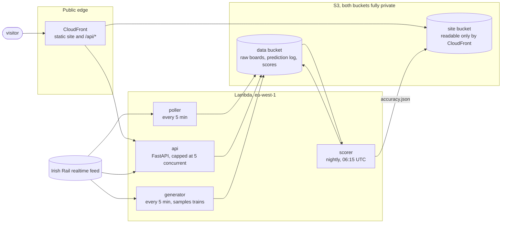
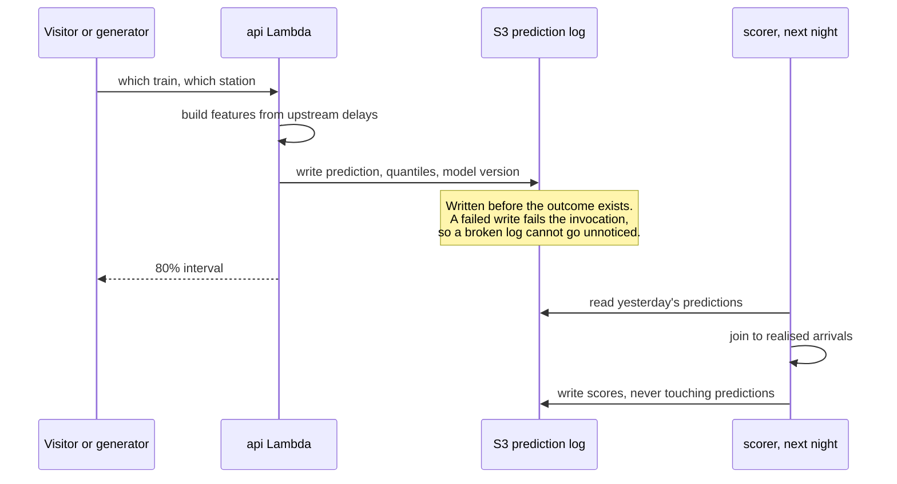

# RailCast

Predicts how late an Irish Rail train will arrive at a stop further along its route, and
answers with an **80% range rather than a single number**.

**Live: https://dc9icf7494up8.cloudfront.net**

> It is 16:30. A220 left Heuston at 16:00 for Cork and has been one to two minutes down at
> Kildare, Portarlington and Portlaoise. Asked about Thurles, the service answers: expected
> 17:07 to 17:14, most likely 17:09, 80% confidence.

One model for the whole network, trained on the [Irish Rail Realtime
API](http://api.irishrail.ie/realtime/), which needs no key and offers no support. Every
prediction is written down before the train arrives and scored against the real arrival the
following night, so the accuracy page is a record rather than a claim.

## The result

Measured against Irish Rail's own `ExpectedArrival`, on matched events where both the model
and the operator answered for the same train, station and moment.

| | RailCast | Irish Rail | Improvement | Matched events |
|---|---|---|---|---|
| Offline, held-out validation | 80.1s | 109.7s | **27%** | 9,077 |
| Live, cumulative since launch | 86.8s | 116.8s | **25.7%** | 27,984 |
| Live, rolling 7 days | 88.5s | 117.7s | 24.8% | 20,761 |

The live figures come from predictions logged before their outcomes existed, against a
baseline that was moving at the same time. The claim survived production on three times the
offline sample.

### The sealed week

A week of data (20 to 26 July) was held out at the start and **never looked at**, not once,
through every model change. An analysis plan was committed to the repository first, saying
what would be measured and what would count as a failure. It was then opened once, on
2026-09-10:

- MAE **58.3s**, median 29.1s, on **217,290** unseen predictions
- Interval coverage **80.0%** against the 80.0% the model claims
- Misses split 10.4% above and 9.6% below, against 10 and 10 expected
- **32.1%** better than a persistence baseline

The intervals were honestly calibrated. That matters for the section below, because it means
the live shortfall is the railway changing, not the model having been optimistic. The week
cannot be used again.

## Where it is wrong

These are on the live site next to the good numbers, not buried here.

**Interval coverage is currently 75.0% against a nominal 80%, and the shortfall is not
evenly spread.**

| Station group | Coverage |
|---|---|
| `commuter_maynooth` | 81.4% |
| `dublin_hubs` | 77.6% |
| `dart` | 77.2% |
| `weak_coverage` | 73.1% |
| `intercity_cork_corridor` | **66.5%** |
| `commuter_kildare` | **62.9%** |
| `intercity_other` | **57.0%** |

A single blended 75.0% would hide two corridors in the sixties, so coverage is never
published as one figure. A degradation trigger written in advance fired on these corridors,
and the decision was to publish the degradation rather than widen the intervals until the
number looked better. Reasoning in decision D64.

**The intervals cover 0% of real delays over an hour.** Every one of those trains was two to
seven minutes late at the moment of asking. No delay-so-far feature can see a disruption that
has not started yet.

**It only answers for a train already running that has reported at an earlier stop.** That is
92.9% of sampled in-service trains, but a station board also lists trains that have not
departed, and for those there is nothing to go on.

## How it works



Four Lambda functions, two S3 buckets, six CloudFormation stacks, nine CloudWatch alarms.
**No database** (the reasoning is decision D40, because "why no database?" is an interview
question), no EC2, no RDS, no VPC, no queues. It costs about **$0.10 a month**, almost all of
it S3 PUT requests.

The site deploys itself from GitHub Actions using OIDC, so **no long-lived AWS key exists in
the repository or in GitHub's secrets**. The public endpoint is capped at five concurrent
executions, which bounds both the bill and the load this project can put on someone else's
free API.

### Why the accuracy page can be trusted



Historical predictions are never regenerated. Recomputing what the model "would have said"
uses today's model against a known outcome, which is leakage. This is enforced by IAM rather
than by discipline: the API may write the prediction prefix and cannot read it, and the
scorer may read it and cannot write it.

## Techniques

LightGBM quantile regression at the 10th, 50th and 90th percentiles, twelve features, all
computable at request time. The load-bearing rule is that **features describe the situation,
not the identity**: train code is not an input, because a model that learned "A218 runs two
minutes down" has nothing to say about a service launched next March.

The ingestion path is deliberately defensive, because the expensive resource is elapsed time
against someone else's server. Fixed-interval request pacing rather than a token bucket, so an
idle period cannot bank credit and fire a burst. AIMD rate control, the same shape as TCP
congestion control. Server-directed backoff when a `Retry-After` arrives. An error taxonomy
that treats a timeout, a 429 and a 404 differently, which is the difference between handling
errors and retrying a rate limit at the same rate. Atomic write-then-rename, so an interrupted
run cannot leave a half-written file that the resume check reads as complete. Full reasoning
and the rejected alternatives are in the decision log.

## Running it

```powershell
python -m venv .venv
.venv\Scripts\Activate.ps1
pip install -r requirements-dev.txt
```

Collect, parse, train, evaluate. All idempotent.

```powershell
python src\harvest_codes.py
python src\backfill.py --start 2026-06-25 --end 2026-07-24
python src\parse_raw.py
python src\build_examples.py
python src\train_quantile.py --save
python scripts\compare_to_operator.py
```

Serve locally, or score a past day.

```powershell
uvicorn api:app --app-dir src
python src\score.py --date 2026-08-31 --dry-run
```

`data/` splits in two and the split is a rule rather than a list of exceptions. Raw XML,
Parquet and poll output are never committed, because they are large and re-fetchable. The
small artifacts a build needs are. The test of that rule is not reading it: clone to a temp
directory and run the build scripts.

## Layout

```
src/          collection, features, model, API, generator, nightly scorer
scripts/      read-only probes and surveys, plus the Lambda build scripts
infra/        CloudFormation and SAM templates
site/         the four pages, Tailwind compiled ahead of time, no framework
docs/         decision log, data dictionary, label quality, feature design
```

## Documentation

The decision log is the primary record. Code comments point at entry numbers rather than
repeating the reasoning.

- **[docs/decisions.md](docs/decisions.md)**. 78 entries: what was chosen, what was rejected,
  and why. It opens with a short guide and a list of the ones worth a stranger's time.
- [docs/story.md](docs/story.md). The whole project as a narrative, written for someone who
  does not code and does not know trains.
- [docs/label-quality.md](docs/label-quality.md). The feed often reports an arrival exactly
  equal to the schedule, which usually means nobody recorded a real time. The obvious fix, to
  distrust the lines the official documentation flags, was tried, appeared to work, and was
  wrong. Simpson's paradox.
- [docs/data-dictionary.md](docs/data-dictionary.md). Every field, tagged by provenance.
  Useful to anyone else trying to use this feed.
- [docs/feature-ideas.md](docs/feature-ideas.md). The rule that admits a feature, the twelve
  that are in, and what was rejected.
- [docs/aws-web-layer.md](docs/aws-web-layer.md). How the public layer is secured, and why
  each control is there.
- [CLAUDE.md](CLAUDE.md). The working rules for changing this repository.

### One theme worth reading for

Eleven failures in this project shared a shape: **none raised an error, and every one produced
output that looked like a correct result.** Arrival times identical to the schedule. 420
successful fetches that were a captive portal. An alarm topic with no subscribers. A model
with a 22-minute average error and a 48-second median. A harvester reporting "0 new codes"
from a folder nothing had written to. An alarm that could not fire, beside a template comment
asserting that it did.

Each was caught the same way: taking a number and asking what it should have been.

## Licence

[MIT](LICENSE). The bundled webfonts are under the SIL Open Font Licence, included beside them
in `site/fonts/`.

Not affiliated with Iarnród Éireann. Data from their public realtime feed.
