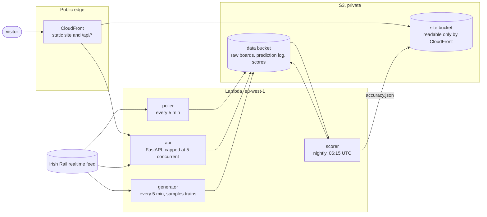
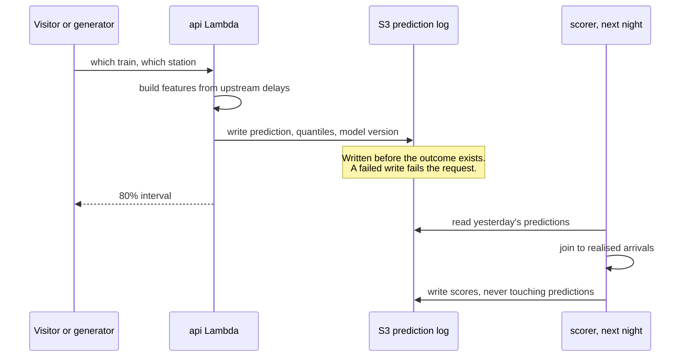

# RailCast

Predicts how late an Irish Rail train will arrive at a stop further along its route, and
answers with an **80% range rather than a single number**.

**Live: https://dc9icf7494up8.cloudfront.net**

> It is 16:30. A220 left Heuston at 16:00 for Cork and has been one to two minutes down at
> Kildare, Portarlington and Portlaoise. Asked about Thurles, the service answers: expected
> 17:07 to 17:14, most likely 17:09, 80% confidence.

One model for the whole network, trained on the public [Irish Rail Realtime
API](http://api.irishrail.ie/realtime/). Every prediction is written down before the train
arrives and scored against the real arrival the following night, so the accuracy page is a
record rather than a claim.

**Built with** Python, LightGBM, FastAPI, AWS Lambda, S3, CloudFront, EventBridge and
CloudWatch, CloudFormation and SAM, GitHub Actions with OIDC, Tailwind CSS and TypeScript.

## Results

Against Irish Rail's own `ExpectedArrival`, on matched events where both answered for the same
train, station and moment:

| | RailCast | Irish Rail | Improvement | Matched events |
|---|---|---|---|---|
| Offline, boards of 1 to 2 Aug 2026 | 80.1s | 109.7s | **27%** | 9,077 |
| Live, launch to 9 Sept 2026 | 86.8s | 116.8s | **25.7%** | 27,984 |
| Live, 3 to 9 Sept 2026 | 88.5s | 117.7s | 24.8% | 20,761 |

The live rows come from predictions logged before their outcomes existed. They are a snapshot:
the [accuracy page](https://dc9icf7494up8.cloudfront.net/accuracy.html) recomputes every live
figure each morning.

**A sealed test week.** One week of July was held out at the start and not looked at through
any model change. An analysis plan was committed first, then the week was opened once, on
2026-09-10: MAE **58.3s** on **217,290** unseen predictions, interval coverage **80.0%**
against the 80.0% claimed, misses split 10.4% below the range and 9.6% above, and **32.1%** better than
a persistence baseline. The intervals were calibrated as claimed, which is why the shortfall
below reads as the railway changing rather than the model being optimistic.

## Where it is wrong

The live site shows these beside the good numbers.

**Interval coverage was 75.0% against a nominal 80% over 3 to 9 September 2026, and the
shortfall is not evenly spread.**

| Station group | Coverage |
|---|---|
| `commuter_maynooth` | 81.4% |
| `dublin_hubs` | 77.6% |
| `dart` | 77.2% |
| `weak_coverage` | 73.1% |
| `intercity_cork_corridor` | **66.5%** |
| `commuter_kildare` | **62.9%** |
| `intercity_other` | **57.0%** |

A single blended figure would hide the lines in the fifties and sixties, so coverage is always
published per group. A degradation trigger written in advance fired on 8 September, and the
decision was to publish the degradation rather than widen the intervals until the number
looked better ([D64](docs/decisions.md)). What changed on those lines has not been
established.

**The intervals cover 0% of real delays over an hour.** Each of those trains was a few minutes
late at the moment of asking, and nothing in how late a train is now can see a disruption that
has not started.

**It only answers for a train already running that has reported at an earlier stop.** That was
92.9% of sampled in-service trains in the same week, but a station board also lists trains
that have not left yet, and for those there is nothing to go on.

## How it works



Four Lambda functions: a poller that captures station boards every five minutes, the API, a
generator that samples running trains so the scoreboard has input, and a nightly scorer.
Three private S3 buckets, for data, the site and access logs. No database
([D40](docs/decisions.md)), no servers, about **$0.10 a month**. The site deploys from GitHub
Actions over OIDC, so **no long-lived AWS key exists in the repository or in GitHub's
secrets**, and the public endpoint is capped at five concurrent executions.



Predictions are never regenerated after the fact, and IAM enforces it rather than habit: the
API can write the prediction log and cannot read it, and the scorer can read it and cannot
write it.

**The model.** LightGBM quantile regression at the 10th, 50th and 90th percentiles, twelve
features, all known at the moment of asking. Features describe the situation rather than the
identity: a train's code is not an input, so a service launched next year works on its first
day ([docs/feature-ideas.md](docs/feature-ideas.md)).

## Running it

```powershell
python -m venv .venv
.venv\Scripts\Activate.ps1
pip install -r requirements-dev.txt
```

Serve the API locally, then the site against it:

```powershell
uvicorn api:app --app-dir src
python scripts\dev_site.py
```

Each module carries an assert-based self-check that runs with no network, for example
`python src\api.py`. CI runs them, together with a stylesheet drift check, a type check and a
WCAG contrast check, before every deploy.

The offline pipeline is `harvest_codes.py`, `backfill.py`, `parse_raw.py`, `build_examples.py`
and `train_quantile.py --save` in `src/`, in that order. Collection takes hours, because it is
throttled to one or two requests a second against a free public API.

## Where things are

```
src/       collection, features, model, API, generator, nightly scorer
scripts/   the analyses behind published findings, and the Lambda build scripts
infra/     CloudFormation and SAM templates
site/      the four pages; Tailwind compiled ahead of time, no framework
docs/      the write-ups below
```

- **[docs/decisions.md](docs/decisions.md).** 83 decisions: what was chosen, what was rejected
  and why. Opens with a guide and the ten worth a stranger's time.
- [docs/story.md](docs/story.md). The whole project as a narrative, for someone who does not
  code and does not know trains.
- [docs/label-quality.md](docs/label-quality.md). Why the feed's arrival times cannot be taken
  at face value, and why the obvious fix was Simpson's paradox.
- [docs/data-dictionary.md](docs/data-dictionary.md). Every field in the feed, tagged by how
  its meaning is known. Useful to anyone else building on it.
- [docs/aws-web-layer.md](docs/aws-web-layer.md). How the public layer is secured, and why.
- [docs/optimization-revision.pdf](docs/optimization-revision.pdf). A separate piece: timetable
  padding redistributed by linear programming, with the proof that the relaxation is exact.
  Nothing in the live service depends on it.
- [CLAUDE.md](CLAUDE.md). The working rules for changing this repository.

## One thread through all of it

Eleven failures in this project shared a shape: **none raised an error, and each produced
output that looked like a correct result.** Arrival times identical to the schedule, successful
downloads that were a captive portal, an alarm with no subscribers, an alarm that could not
fire beside a comment saying it did. Each was caught the same way: by taking a number and
asking what it should have been.

## Licence

[MIT](LICENSE). The bundled webfonts are under the SIL Open Font Licence, included beside them
in `site/fonts/`.

Not affiliated with Iarnród Éireann. Data from their public realtime feed.
